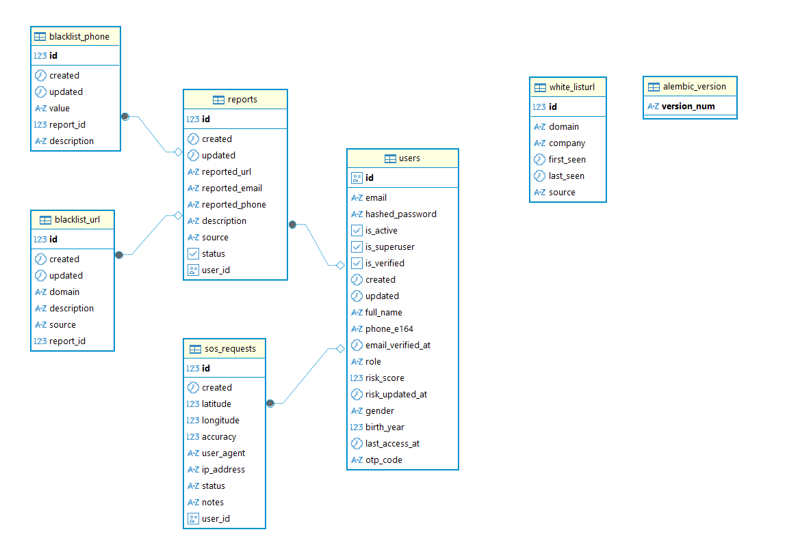
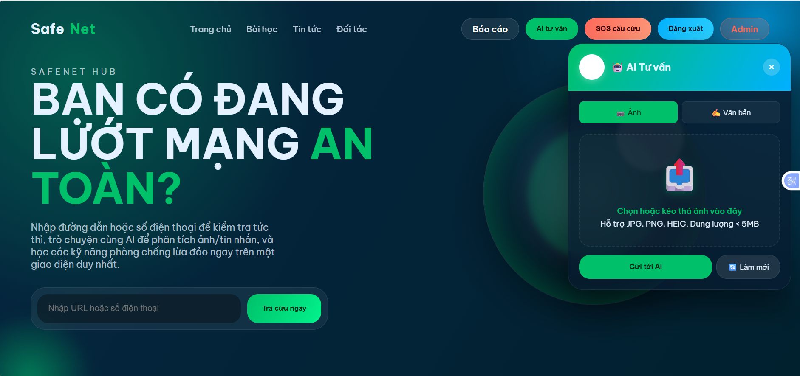
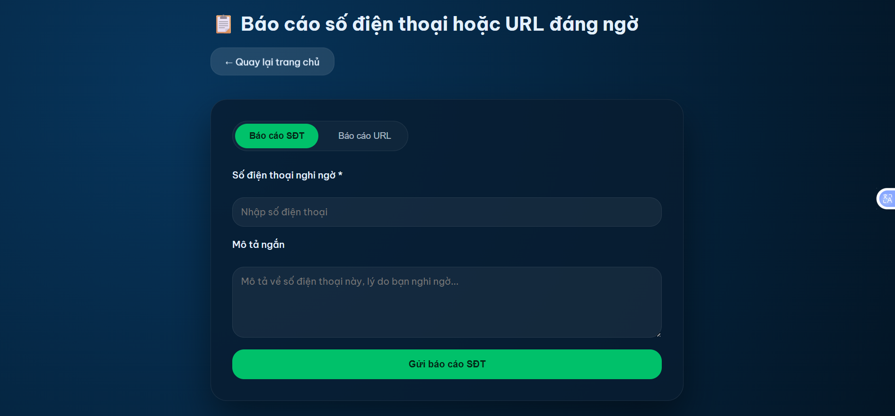
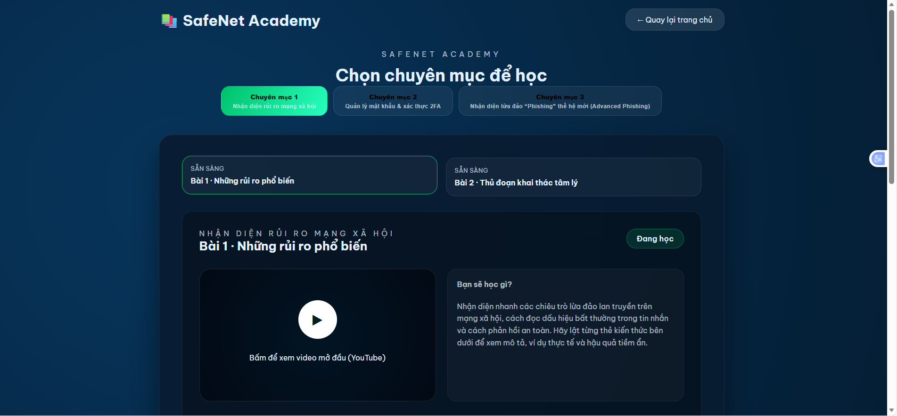
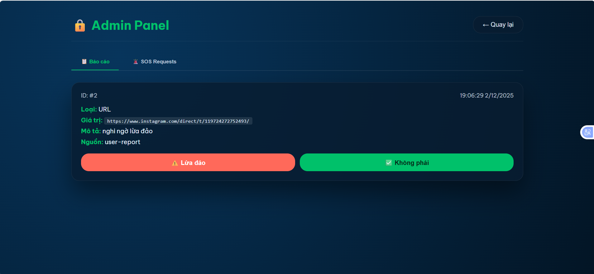
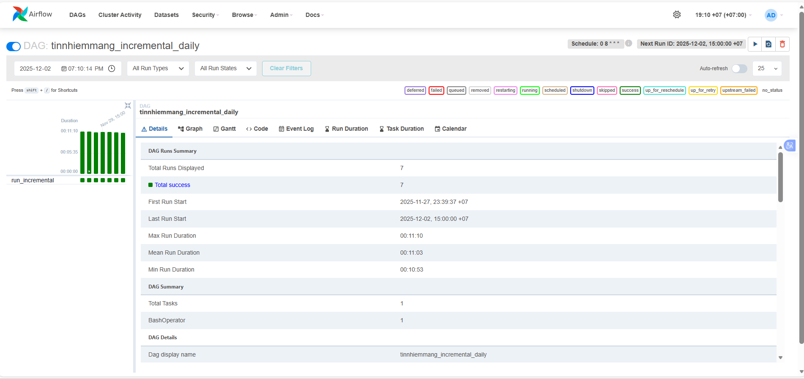

# Fraud Alert API - Hệ Thống Phát Hiện Lừa Đảo

Web phát hiện lừa đảo từ ảnh tin nhắn sử dụng OCR và AI.

## Quy Trình Làm Việc

### 1. Kiến trúc Database



### 2. Luồng xử lý bằng AI 

```
Người dùng upload ảnh tin nhắn hoặc nhập text
    ↓
Tiền xử lý ảnh (OpenCV: crop, sharpen, enhance)
    ↓
OCR tiếng Việt (Vintern-1B-v3.5) - Trích xuất text hoặc nhập text trực tiếp
    ↓
Làm sạch text (giữ nguyên dấu tiếng Việt)
    ↓
Phân tích ngữ cảnh, đưa ra kết quả có lừa đảo hay không lừa đảo bằng Gemini AI
    ↓
Trả kết quả: Cảnh báo và khuyến nghị chi tiết
```

## Các Tính Năng Chính

### Trang chủ - Tra cứu và AI tư vấn, giao diện tra cứu số điện thoại và URL lừa đảo



Upload ảnh hoặc nhập text để phân tích lừa đảo bằng AI

### Hệ thống báo cáo



Người dùng gửi báo cáo đến admin để xử lý

### Bài học phòng chống lừa đảo



Kiến thức và tips nhận biết lừa đảo

### Quản trị Admin



Dashboard quản lý báo cáo và xử lý SOS

### Airflow Crawler



Crawler tự động domain tin cậy từ tinnhiemmang.vn

## Khởi Động Dự Án

### Cài đặt và chạy

```powershell
# Build image API
docker-compose build app

# Khởi động toàn bộ hệ thống
docker-compose up -d

# Kiểm tra trạng thái
docker-compose ps
```

## Truy Cập Hệ Thống

- Web UI: http://34.142.202.55:5000/index.html
- API Documentation: http://34.142.202.55:5000/docs/
- Airflow: http://34.142.202.55:8083/home
```
## Tech Stack

- Backend: FastAPI, SQLAlchemy, PostgreSQL
- AI/ML: Vintern-1B-v3.5 (OCR), Gemini AI (phân tích)
- Infrastructure: Docker, Apache Airflow
- Frontend: HTML/CSS/JavaScript


